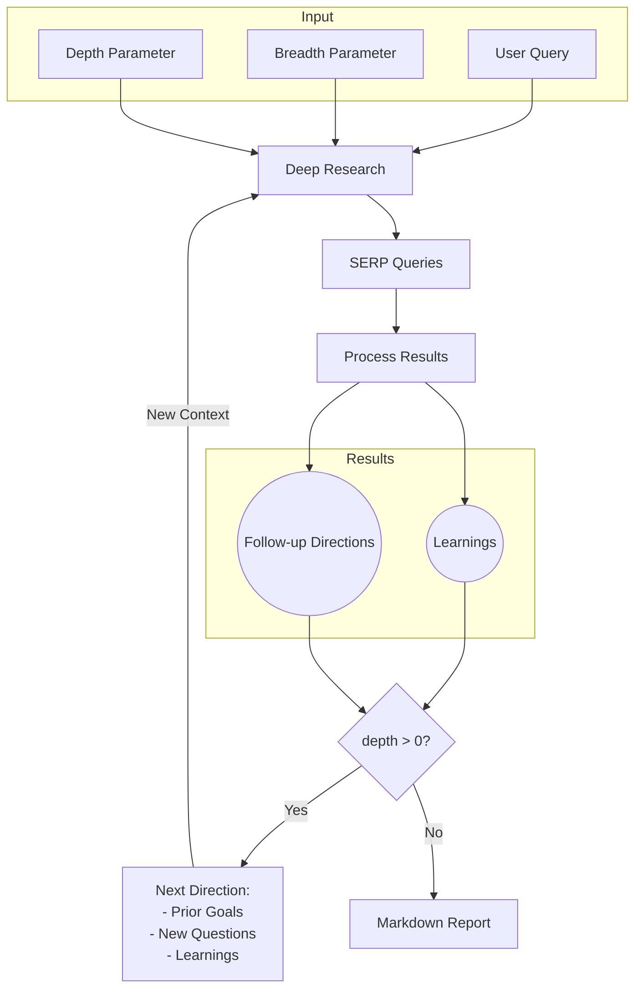

# Open Deep Research: Pipeline Documentation

This document provides a detailed breakdown of the Open Deep Research pipeline, including all algorithms, prompts, and external dependencies required to reproduce the system from scratch.

## System Overview

Open Deep Research is an AI-powered research assistant that performs iterative, deep research on any topic by combining search engines, web scraping, and large language models. The system takes a user query, generates multiple search queries, processes the results, extracts learnings, and recursively explores deeper based on those findings.



## Complete Pipeline Algorithm

### Initialization
1. The user provides:
   - A research query
   - Breadth parameter (recommended: 3-10, default: 4)
   - Depth parameter (recommended: 1-5, default: 2)
   - Output preference (detailed report or concise answer)

2. If generating a detailed report:
   - Generate follow-up questions to refine research direction
   - Collect user answers to these questions
   - Combine initial query with follow-up Q&A to form a comprehensive research context

### CLI Interface Implementation
The system implements an interactive CLI interface that:

1. Prompts the user for:
   ```
   What would you like to research? <user input>
   Enter research breadth (recommended 2-10, default 4): <user input>
   Enter research depth (recommended 1-5, default 2): <user input>
   Do you want to generate a long report or a specific answer? (report/answer, default report): <user input>
   ```

2. For report mode, it follows up with user-specific questions:
   - Dynamically generates 2-3 clarifying questions based on the research topic
   - Presents each question one at a time to the user
   - Collects and incorporates answers into the research context

3. Progress Reporting:
   - Displays real-time status during execution: `Starting research...`
   - Shows current depth/breadth position: `Researching deeper, breadth: X, depth: Y`
   - Displays current query being processed: `Running query: "example query"`
   - Indicates completion stages: `Created X learnings...`
   - Shows final stats: `Learnings: <list>` and `Visited URLs: <count>`

4. Final Output:
   - Announces completion: `Writing final report...`
   - Indicates save location: `Report has been saved to report.md`

### API Implementation Details

The system exposes an HTTP API endpoint for programmatic access:

1. **API Endpoint Structure**:
   - `POST /api/research` - Main research endpoint

2. **Request Format**:
   ```json
   {
     "query": "Your research question here",
     "depth": 2,
     "breadth": 3
   }
   ```
   - `query` (required): The research question or topic
   - `depth` (optional, default: 3): Recursive research depth
   - `breadth` (optional, default: 3): Number of parallel search queries

3. **Response Format**:
   ```json
   {
     "success": true,
     "answer": "Concise answer text",
     "learnings": ["Learning 1", "Learning 2", "..."],
     "visitedUrls": ["https://example.com/page1", "..."]
   }
   ```
   - Success case includes all research findings
   - Error responses follow standard HTTP status codes with descriptive messages

4. **API Authentication**:
   - By default, no authentication is implemented for simplicity
   - For production deployments, implement authorization middleware:
     ```typescript
     // Example implementation for API key authentication
     app.use((req, res, next) => {
       const apiKey = req.headers['x-api-key'];
       if (!apiKey || apiKey !== process.env.API_SECRET) {
         return res.status(401).json({ error: 'Unauthorized' });
       }
       next();
     });
     ```

5. **Programmatic Usage Example**:
   ```javascript
   // Node.js example
   const axios = require('axios');
   
   async function runResearch() {
     try {
       const response = await axios.post('http://localhost:3051/api/research', {
         query: 'Impact of quantum computing on cryptography',
         depth: 2,
         breadth: 4
       });
       
       console.log('Answer:', response.data.answer);
       console.log('Learnings:', response.data.learnings);
     } catch (error) {
       console.error('Research failed:', error.response?.data || error.message);
     }
   }
   
   runResearch();
   ```

### Main Research Algorithm (deepResearch function)
1. Initialize progress tracking variables:
   ```
   progress = {
     currentDepth: depth,
     totalDepth: depth,
     currentBreadth: breadth,
     totalBreadth: breadth,
     totalQueries: 0,
     completedQueries: 0
   }
   ```

2. Generate SERP (Search Engine Results Page) queries:
   - Use LLM to generate `breadth` number of search queries based on the research context
   - Each query includes a research goal and direction

3. For each SERP query (processed in parallel with concurrency limit):
   - Execute web search via Firecrawl API
   - Extract content from search results
   - Process results with LLM to generate:
     - Key learnings (max: 3 by default)
     - Follow-up questions (max: 3 by default)
   - Collect all URLs from search results
   - Update research progress

4. Recursive Depth Exploration:
   - If current depth > 0:
     - Decrement depth by 1
     - Calculate new breadth (ceil(breadth/2))
     - Construct new query combining:
       - Previous research goal
       - Follow-up research directions
       - Learnings so far
     - Recursively call deepResearch with new parameters
   - If depth = 0:
     - Return all collected learnings and visited URLs

5. Result Aggregation:
   - Combine and deduplicate all learnings and URLs from all parallel searches
   - Return final result set

### Error Handling and Retry Logic
1. Timeout Management:
   - Sets explicit timeouts for API calls (e.g., 15 seconds for search, 60 seconds for LLM)
   - Implemented using AbortSignal.timeout()
   
2. Error Handling:
   - Catches and logs specific error types (e.g., timeout errors vs. other errors)
   - For search errors: `Timeout error running query: ${query}`
   - For general errors: `Error running query: ${query}`
   
3. Graceful Degradation:
   - If a search or processing step fails, continues with available results
   - Returns empty arrays for failed operations rather than crashing
   - Example: `return { learnings: [], visitedUrls: [] }` on error

4. No explicit retry logic is implemented, but the parallel nature of searches provides redundancy

### Final Output Generation
1. If report mode:
   - Generate comprehensive markdown report using all learnings
   - Append all visited URLs as sources
   - Save to report.md

2. If answer mode:
   - Generate concise answer based on all learnings
   - Save to answer.md

## Detailed Component Breakdown

### 1. Query Generation (generateSerpQueries)
- **Input**: User query, number of queries to generate, previous learnings (optional)
- **Process**: 
  - Send prompt to LLM requesting SERP queries
  - LLM generates unique queries with research goals
- **Output**: Array of objects with query text and research goal
- **Schema**:
  ```typescript
  z.object({
    queries: z.array(
      z.object({
        query: z.string().describe('The SERP query'),
        researchGoal: z.string().describe(
          'First talk about the goal of the research that this query is meant to accomplish, then go deeper into how to advance the research once the results are found, mention additional research directions. Be as specific as possible, especially for additional research directions.'
        ),
      })
    ).describe(`List of SERP queries, max of ${numQueries}`),
  })
  ```

### 2. Search Result Processing (processSerpResult)
- **Input**: Query, search results, number of learnings/follow-ups to extract
- **Process**:
  - Extract and trim content from search results
  - Send content to LLM with prompt requesting learnings and follow-up questions
- **Output**: Object containing learnings array and followUpQuestions array
- **Schema**:
  ```typescript
  z.object({
    learnings: z.array(z.string()).describe(`List of learnings, max of ${numLearnings}`),
    followUpQuestions: z.array(z.string()).describe(
      `List of follow-up questions to research the topic further, max of ${numFollowUpQuestions}`
    ),
  })
  ```

### 3. Report Generation (writeFinalReport)
- **Input**: Original prompt, all learnings, all visited URLs
- **Process**:
  - Send prompt to LLM requesting comprehensive report
  - Format learnings as input context
  - Append visited URLs as sources
- **Output**: Markdown-formatted report
- **Schema**:
  ```typescript
  z.object({
    reportMarkdown: z.string().describe('Final report on the topic in Markdown'),
  })
  ```

### 4. Answer Generation (writeFinalAnswer)
- **Input**: Original prompt, all learnings
- **Process**:
  - Send prompt to LLM requesting concise answer
  - Format learnings as input context
- **Output**: Short, direct answer
- **Schema**:
  ```typescript
  z.object({
    exactAnswer: z.string().describe(
      'The final answer, make it short and concise, just the answer, no other text'
    ),
  })
  ```

### 5. Feedback Generation (generateFeedback)
- **Input**: User query, number of questions to generate
- **Process**: 
  - Send prompt to LLM requesting follow-up questions
- **Output**: Array of follow-up questions
- **Schema**:
  ```typescript
  z.object({
    questions: z.array(z.string()).describe(
      `Follow up questions to clarify the research direction, max of ${numQuestions}`
    ),
  })
  ```

### 6. Text Splitting Implementation
The system uses a `RecursiveCharacterTextSplitter` to handle large text chunks and respect token limits:

1. **Behavior**:
   - Splits text at semantic boundaries in a hierarchical manner
   - Order of splitting (most to least preferred): `\n\n`, `\n`, `. `, ` `, ``

2. **Implementation**:
   ```typescript
   class RecursiveCharacterTextSplitter {
     constructor({
       chunkSize = 4000,
       chunkOverlap = 200,
     }: {
       chunkSize?: number;
       chunkOverlap?: number;
     }) {
       this.chunkSize = chunkSize;
       this.chunkOverlap = chunkOverlap;
     }
     
     // Recursive splitting method
     splitText(text: string): string[] {
       // Start with largest separator (\n\n) and try to split
       // If chunks are still too large, try next separator (\n)
       // Continue until all chunks are appropriate size or smallest separator is reached
       // Return array of optimally sized text chunks
     }
   }
   ```

3. **Token Efficiency**:
   - Uses tiktoken (js-tiktoken) for accurate token counting based on model's tokenizer
   - Dynamically adjusts chunk size based on available context window
   - Prioritizes maintaining important content within token limits
   - Implements recursive trimming to ensure content fits within context limits:
     ```typescript
     function trimPrompt(prompt: string, contextSize = 128_000) {
       // 1. Check if prompt exceeds token limit
       // 2. If yes, calculate appropriate chunk size
       // 3. Recursively trim until within token limit
       // 4. Return trimmed prompt
     }
     ```

## Web Scraping Capabilities

The Open Deep Research system utilizes Firecrawl for web search and content extraction:

### 1. Firecrawl API Capabilities
- **Search Engine Integration**: 
  - Connects to multiple search engines to gather diverse results
  - Filters out duplicate/similar content
  - Ranks results by relevance to the query

- **Content Extraction**:
  - Automatically scrapes full page content from search results
  - Cleans HTML and extracts main textual content
  - Preserves necessary formatting and structure
  - Formats content as clean markdown

- **Supported Formats**:
  - HTML web pages (primary format)
  - PDF documents (with text extraction)
  - News articles and blogs (with special handling for common layouts)
  - Academic papers (limited support)
  - Documentation sites

### 2. Handling Challenging Content
- **Paywalled Content**:
  - Limited ability to access paywalled articles
  - May retrieve partial content or abstracts
  - For news sites: often retrieves content before paywall triggers

- **JavaScript-Heavy Sites**:
  - Handles basic JS-rendered content
  - May have limited access to dynamically loaded content
  - Focuses on static content that's indexable by search engines

- **Rate Limiting and Politeness**:
  - Implements automatic rate limiting to prevent overloading sites
  - Respects robots.txt directives
  - Uses appropriate request headers and delays between requests
  - Free tier: 60 requests per hour (can be a limitation for large research)
  - Paid tiers: Higher limits with configurable concurrency

### 3. Implementation Details
```typescript
// Search request with content extraction
const result = await firecrawl.search(query, {
  timeout: 15000,  // 15 second timeout
  limit: 5,        // Get top 5 results
  scrapeOptions: { 
    formats: ['markdown']  // Extract content as markdown
  }
});

// Example result structure
/* 
{
  data: [
    {
      url: "https://example.com/article",
      title: "Article Title",
      snippet: "Short preview of the content...",
      markdown: "# Article Title\n\nFull extracted content in markdown format..."
    },
    ...
  ]
}
*/
```

## Prompts Used in the Pipeline

### 1. System Prompt (used for all LLM interactions)
```
You are an expert researcher. Today is ${current_date}. Follow these instructions when responding:
- You may be asked to research subjects that is after your knowledge cutoff, assume the user is right when presented with news.
- The user is a highly experienced analyst, no need to simplify it, be as detailed as possible and make sure your response is correct.
- Be highly organized.
- Suggest solutions that I didn't think about.
- Be proactive and anticipate my needs.
- Treat me as an expert in all subject matter.
- Mistakes erode my trust, so be accurate and thorough.
- Provide detailed explanations, I'm comfortable with lots of detail.
- Value good arguments over authorities, the source is irrelevant.
- Consider new technologies and contrarian ideas, not just the conventional wisdom.
- You may use high levels of speculation or prediction, just flag it for me.
```

### 2. SERP Query Generation Prompt
```
Given the following prompt from the user, generate a list of SERP queries to research the topic. Return a maximum of ${numQueries} queries, but feel free to return less if the original prompt is clear. Make sure each query is unique and not similar to each other: <prompt>${query}</prompt>

${learnings ? `Here are some learnings from previous research, use them to generate more specific queries: ${learnings.join('\n')}` : ''}
```

### 3. Search Results Processing Prompt
```
Given the following contents from a SERP search for the query <query>${query}</query>, generate a list of learnings from the contents. Return a maximum of ${numLearnings} learnings, but feel free to return less if the contents are clear. Make sure each learning is unique and not similar to each other. The learnings should be concise and to the point, as detailed and information dense as possible. Make sure to include any entities like people, places, companies, products, things, etc in the learnings, as well as any exact metrics, numbers, or dates. The learnings will be used to research the topic further.

<contents>${contents.map(content => `<content>\n${content}\n</content>`).join('\n')}</contents>
```

### 4. Final Report Generation Prompt
```
Given the following prompt from the user, write a final report on the topic using the learnings from research. Make it as as detailed as possible, aim for 3 or more pages, include ALL the learnings from research:

<prompt>${prompt}</prompt>

Here are all the learnings from previous research:

<learnings>
${learningsString}
</learnings>
```

### 5. Final Answer Generation Prompt
```
Given the following prompt from the user, write a final answer on the topic using the learnings from research. Follow the format specified in the prompt. Do not yap or babble or include any other text than the answer besides the format specified in the prompt. Keep the answer as concise as possible - usually it should be just a few words or maximum a sentence. Try to follow the format specified in the prompt (for example, if the prompt is using Latex, the answer should be in Latex. If the prompt gives multiple answer choices, the answer should be one of the choices).

<prompt>${prompt}</prompt>

Here are all the learnings from research on the topic that you can use to help answer the prompt:

<learnings>
${learningsString}
</learnings>
```

### 6. Feedback Generation Prompt
```
Given the following query from the user, ask some follow up questions to clarify the research direction. Return a maximum of ${numQuestions} questions, but feel free to return less if the original query is clear: <query>${query}</query>
```

### Prompt Customization for Specific Domains

The system's prompts can be customized for specific research domains:

1. **Academic Research Customization**:
   ```typescript
   // Modified system prompt for academic research
   const academicSystemPrompt = () => {
     const basePrompt = systemPrompt();
     return `${basePrompt}\n\nAdditional instructions for academic research:
     - Prioritize peer-reviewed sources and academic databases
     - Use precise scientific terminology
     - Distinguish between established theories and emerging hypotheses
     - Include methodological details when relevant
     - Consider limitations of research methods and findings`;
   };
   ```

2. **Business Intelligence Customization**:
   ```typescript
   // Modified report generation for business use cases
   async function writeBusinessReport(params) {
     // Use business-specific prompt
     const businessPrompt = `Given the following business intelligence query, write a final report structured with:
     1. Executive Summary (1 paragraph)
     2. Key Findings (bullet points)
     3. Market Analysis
     4. Competitive Landscape
     5. Recommendations
     6. Risks and Limitations
     
     <prompt>${params.prompt}</prompt>
     
     Here are all the learnings from research:
     <learnings>${params.learnings.join('\n')}</learnings>`;
     
     // Use the same schema but with customized prompt
     const res = await generateObject({
       model: getModel(),
       system: systemPrompt(),
       prompt: trimPrompt(businessPrompt),
       schema: z.object({
         reportMarkdown: z.string().describe('Final business report in Markdown'),
       }),
     });
     
     return res.object.reportMarkdown;
   }
   ```

3. **Legal Domain Example**:
   - Modify SERP query generation to include legal databases and case law searches
   - Add jurisdiction specifications
   - Include date range parameters for relevant precedents
   - Structure reports with legal citation formats

## Required Tools and Dependencies

### External APIs and Services
1. **Firecrawl API** - Used for web search and content extraction
   - Requires API key (set as `FIRECRAWL_KEY` environment variable)
   - Optional base URL for self-hosted instances (set as `FIRECRAWL_BASE_URL`)
   - Configurable concurrency limit (set as `FIRECRAWL_CONCURRENCY`)

2. **LLM API** - One of the following is required:
   - **OpenAI API** - Primary LLM provider (set `OPENAI_KEY`)
     - Default model: o3-mini
     - Optional custom endpoint (set `OPENAI_ENDPOINT`)
   - **Fireworks.ai API** - Optional alternative provider (set `FIREWORKS_KEY`)
     - Default model: DeepSeek R1
   - **Custom LLM API** - Optional alternative (requires OpenAI-compatible API)
     - Set custom model name with `CUSTOM_MODEL`

### Node.js Dependencies
1. **Core Dependencies**
   - `@mendable/firecrawl-js` - Client library for Firecrawl API
   - `ai` - Framework for working with AI models
   - `@ai-sdk/openai` - OpenAI integration
   - `@ai-sdk/fireworks` - Fireworks integration
   - `js-tiktoken` - Token counting for context length management
   - `lodash-es` - Utility functions
   - `p-limit` - Concurrency control
   - `zod` - Schema validation
   - `express`, `cors` - API server (if using API mode)

2. **Development Dependencies**
   - `typescript` - Type checking
   - `tsx` - TypeScript execution
   - `prettier` - Code formatting

### Environment Variables
```
FIRECRAWL_KEY="YOUR_KEY"
FIRECRAWL_BASE_URL="http://localhost:3002"  # Optional, for self-hosted Firecrawl
FIRECRAWL_CONCURRENCY="2"  # Optional, defaults to 2

OPENAI_KEY="YOUR_KEY"  # Required if using OpenAI
CONTEXT_SIZE="128000"  # Optional, defaults to 128000

OPENAI_ENDPOINT="http://localhost:11434/v1"  # Optional, for custom endpoint
CUSTOM_MODEL="llama3.1"  # Optional, for custom model

FIREWORKS_KEY="YOUR_KEY"  # Optional, for using DeepSeek R1 model
```

## Docker Implementation

The system can be deployed using Docker for consistent environments across different platforms:

1. **Docker Configuration**:
   - Uses Node 22.x as the base image
   - Dockerfile:
     ```dockerfile
     FROM node:22-alpine
     WORKDIR /app
     COPY package*.json ./
     RUN npm install
     COPY . .
     CMD ["npm", "run", "docker"]
     ```

2. **Docker Compose Setup**:
   ```yaml
   version: '3'
   services:
     app:
       build: .
       container_name: deep-research
       env_file:
         - .env.local
       volumes:
         - .:/app
         - /app/node_modules
   ```

3. **Docker Execution**:
   ```bash
   # Build and start the container
   docker compose up -d
   
   # Run the research assistant inside the container
   docker exec -it deep-research npm run docker
   ```

4. **Docker-specific Environment**:
   - In Docker mode, environment variables are loaded directly from the container environment
   - `npm run docker` runs the CLI without the `.env.local` loading step (handled by Docker)

## Local LLM Integration

The system supports connecting to local LLM servers with these methods:

1. **OpenAI-compatible API Integration**:
   - Configure environment variables:
     ```
     # Comment out OPENAI_KEY
     # OPENAI_KEY="YOUR_KEY"
     
     # Add local endpoint and model
     OPENAI_ENDPOINT="http://localhost:1234/v1"
     CUSTOM_MODEL="llama3.1"
     ```

2. **Supported Local Server Types**:
   - [LM Studio](https://lmstudio.ai/) - Set endpoint to http://localhost:1234/v1
   - [Ollama](https://ollama.com/) - Set endpoint to http://localhost:11434/v1
   - [LocalAI](https://localai.io/) - Set endpoint to appropriate URL
   - Any server that implements OpenAI-compatible API

3. **Implementation Details**:
   ```typescript
   // Model selection logic
   const customModel = process.env.CUSTOM_MODEL
     ? openai?.(process.env.CUSTOM_MODEL, {
         structuredOutputs: true,
       })
     : undefined;
   
   export function getModel(): LanguageModelV1 {
     if (customModel) {
       return customModel;
     }
     // Fall back to other models if custom model not configured
   }
   ```

4. **Model Requirements**:
   - Must support JSON mode / structured output generation
   - Should have sufficient context window (16K+ tokens recommended)
   - Should understand special markup/XML-like formatting in prompts
   - Models like Llama 3, Mistral, or Claude-compatible models work best

## Security Considerations

When implementing Open Deep Research, consider these security aspects:

### 1. API Key Management
- **Never hardcode API keys** in source code or commit them to version control
- Store API keys in environment variables or secret management systems
- Use `.env.local` which is gitignored by default
- For production deployments:
  - Use environment variable injection via CI/CD pipelines
  - Consider vault services (AWS Secrets Manager, HashiCorp Vault, etc.)
  - Rotate keys periodically

### 2. Data Privacy and Retention
- **User Queries**: 
  - Consider whether to log user queries and for how long
  - Implement data retention policies
  - Be transparent about data usage

- **Research Results**:
  - Consider sensitivity of generated reports
  - Implement access controls for API endpoints
  - Delete temporary files if not needed

- **LLM Provider Privacy**:
  - Be aware that queries sent to external LLM providers may be logged
  - For sensitive research, consider using local models only
  - Check provider terms of service regarding data usage

### 3. Input Validation
- Sanitize user inputs to prevent injection attacks
- Validate parameters (depth, breadth) to prevent resource exhaustion
- Example implementation:
  ```typescript
  // Simple input validation middleware
  app.use((req, res, next) => {
    // Validate query
    if (!req.body.query || typeof req.body.query !== 'string') {
      return res.status(400).json({ error: 'Invalid query parameter' });
    }
    
    // Limit depth/breadth to prevent abuse
    req.body.depth = Math.min(Math.max(1, req.body.depth || 2), 5);
    req.body.breadth = Math.min(Math.max(1, req.body.breadth || 3), 10);
    
    next();
  });
  ```

### 4. Potential Security Risks
- **Rate Limiting**: Implement to prevent API abuse
- **Content Filtering**: Consider implementing content moderation for sensitive topics
- **Resource Consumption**: Set timeouts and limits to prevent DoS attacks
- **Third-party Dependencies**: Regularly update dependencies to patch vulnerabilities

## Performance Metrics

Understanding performance characteristics helps with deployment planning and scaling:

### 1. Execution Time Benchmarks
- **Single Depth Level Research (depth=1)**:
  - Simple query: 30-60 seconds
  - Complex query: 1-3 minutes
  
- **Medium Depth Research (depth=2)**:
  - Simple query: 1-3 minutes
  - Complex query: 3-7 minutes
  
- **Deep Research (depth=3+)**:
  - Simple query: 3-8 minutes
  - Complex query: 8-20 minutes

- **Factors Affecting Speed**:
  - Firecrawl API response times
  - LLM processing times
  - Network latency
  - Concurrency settings

### 2. Resource Requirements
- **Memory Usage**:
  - Base process: ~100-200 MB
  - During research: 200-500 MB (varies with depth/breadth)
  
- **CPU Usage**:
  - Mostly I/O bound, not CPU intensive
  - Spikes during text processing and report generation
  - Single CPU core is typically sufficient
  
- **Network Bandwidth**:
  - Moderate usage: ~5-20 MB per research session
  - Scales with depth and breadth parameters

### 3. Scaling Considerations
- **Vertical Scaling**:
  - Increase concurrency for faster processing: `FIRECRAWL_CONCURRENCY=4`
  - Requires paid Firecrawl API plan for higher rate limits
  
- **Horizontal Scaling**:
  - Run multiple instances for parallel research projects
  - Use load balancer for API mode with multiple instances
  
- **Cost Optimization**:
  - Cache common searches to reduce API calls
  - Implement results persistence to avoid redundant research
  - Use local LLMs for cost reduction

## Testing Methodology

To ensure quality and reliability, implement these testing approaches:

### 1. Component Testing
- **LLM Interaction Tests**:
  ```typescript
  // Example test for query generation
  test('generateSerpQueries produces valid queries', async () => {
    const queries = await generateSerpQueries({
      query: 'Test query',
      numQueries: 3
    });
    
    expect(queries.length).toBeLessThanOrEqual(3);
    expect(queries[0]).toHaveProperty('query');
    expect(queries[0]).toHaveProperty('researchGoal');
  });
  ```

- **Search Result Processing Tests**:
  - Use mock search results to test extraction logic
  - Verify learning extraction produces useful content
  - Test edge cases (empty results, malformed content)

### 2. Integration Testing
- **Full Pipeline Tests**:
  - Run end-to-end research with controlled queries
  - Verify recursive exploration works correctly
  - Test error handling and recovery

- **Cross-Provider Testing**:
  - Test with different LLM providers
  - Verify compatibility with various search backends

### 3. Research Quality Evaluation
- **Factual Accuracy Checks**:
  - Use known-answer questions to verify results
  - Cross-reference findings with authoritative sources
  - Track facts to source documents

- **Output Quality Metrics**:
  - Information density (facts per paragraph)
  - Source diversity (number of unique domains)
  - Query relevance (how well learnings match initial query)

- **Manual Evaluation Checklist**:
  ```
  1. Is the information accurate?
  2. Are sources credible and diverse?
  3. Does the report cover the topic comprehensively?
  4. Is the content well-organized and coherent?
  5. Are important nuances and caveats included?
  ```

## Known Limitations

Being aware of system limitations helps set appropriate expectations:

### 1. Content Access Limitations
- **Paywalled Content**: Limited access to subscription-only sources
- **Recent Events**: May struggle with very recent events not yet well-indexed
- **Deep Web Content**: Cannot access content not indexed by search engines
- **Image and Video Content**: Cannot extract information from non-text media

### 2. Language and Region Limitations
- **Non-English Content**: 
  - Primary focus is English-language content
  - Limited capability with other major languages
  - Poor performance with low-resource languages
  
- **Regional Bias**:
  - Search results may favor US/Western sources
  - May miss region-specific information for international topics
  - Consider adding region-specific terms to queries for better results

### 3. Topic-Specific Challenges
- **Highly Technical Topics**: 
  - May oversimplify complex technical subjects
  - Consider domain-specific prompt tuning
  
- **Controversial Topics**:
  - May struggle with balanced representation of polarized issues
  - Source bias may affect research quality
  
- **Rapidly Evolving Topics**:
  - Information may be outdated for fast-changing subjects
  - Consider shorter depth but more frequent research runs

### 4. Technical Limitations
- **LLM Context Windows**: 
  - Despite chunking, very large research projects may hit context limits
  - Maximum output size constrained by model capabilities
  
- **API Rate Limits**:
  - Free tier Firecrawl limited to 60 requests/hour
  - Deep research with high breadth may trigger rate limits
  
- **Error Propagation**:
  - Errors in early research stages can influence later findings
  - No built-in fact verification or correction mechanism

## Examples

### Example 1: Basic Research Query

**Input:**
```
What would you like to research? The impact of quantum computing on cryptography
Enter research breadth (recommended 2-10, default 4): 4
Enter research depth (recommended 1-5, default 2): 2
Do you want to generate a long report or a specific answer? (report/answer, default report): report

To better understand your research needs, please answer these follow-up questions:

What specific aspects of cryptography are you most interested in understanding?
Your answer: Post-quantum cryptography standards and timeline for implementation

Are you interested in near-term impacts or long-term theoretical possibilities?
Your answer: Both, with emphasis on how organizations should prepare now

Do you want to focus on any particular quantum computing approaches (e.g., gate-based, annealing)?
Your answer: Gate-based quantum computers and their scaling timeline
```

**Generated SERP Queries:**
1. "Post-quantum cryptography NIST standards timeline implementation"
2. "Quantum computing threat timeline to RSA and ECC cryptography"
3. "Gate-based quantum computers scaling roadmap for cryptographic applications"
4. "Enterprise preparation transition post-quantum cryptography"

**Sample Learnings:**
- "NIST announced four post-quantum cryptographic algorithms for standardization in July 2022: CRYSTALS-Kyber for key establishment and CRYSTALS-Dilithium, FALCON, and SPHINCS+ for digital signatures, with standards expected to be finalized by 2024."
- "Shor's algorithm on a sufficiently powerful quantum computer could break RSA-2048 in hours, but experts estimate that building such a quantum computer would require 20+ million physical qubits, which may be 10-15 years away according to current scaling trends."
- "Organizations are advised to implement crypto-agility frameworks now, allowing for rapid replacement of cryptographic algorithms when needed, with complete inventory of cryptographic assets as the critical first step."

**Final Report Section Example:**
```markdown
## Current State of Quantum Computing

As of 2023, the most advanced gate-based quantum computers have reached approximately 433 physical qubits (IBM Osprey), but with high error rates requiring error correction. Experts estimate that breaking RSA-2048 would require a quantum computer with 20+ million physical qubits implementing Shor's algorithm. According to current scaling trends in quantum computing, such capabilities may be 10-15 years away, though breakthroughs in quantum error correction could accelerate this timeline.

Quantum computing approaches relevant to cryptography are primarily focused on gate-based quantum computers rather than quantum annealers, as Shor's algorithm for breaking public-key cryptography requires the circuit model. Major players in gate-based quantum computing include IBM, Google, IonQ, and PsiQuantum, each with different qubit technologies and scaling approaches.
```

### Example 2: Specific Answer Query

**Input:**
```
What would you like to research? When will the 2024 Summer Olympics begin?
Enter research breadth (recommended 2-10, default 4): 2
Enter research depth (recommended 1-5, default 2): 1
Do you want to generate a long report or a specific answer? (report/answer, default report): answer
```

**Generated SERP Queries:**
1. "2024 Summer Olympics Paris opening ceremony date time"
2. "Paris 2024 Olympic Games official schedule start date"

**Sample Learnings:**
- "The 2024 Summer Olympics in Paris will officially begin with the Opening Ceremony on Friday, July 26, 2024."
- "Unlike traditional Olympic opening ceremonies, the Paris 2024 Opening Ceremony will take place along the Seine River rather than in a stadium, with over 10,500 athletes parading on boats."

**Final Answer:**
```
July 26, 2024
```

## Technical Implementation Details

### Text Processing
- Uses RecursiveCharacterTextSplitter for handling large text chunks
- Implements token counting via tiktoken to respect model context limits
- Trims content to fit within context window (default: 128,000 tokens)

### Concurrency Management
- Uses p-limit to control concurrent API calls
- Default concurrency limit: 2 (configurable via environment variables)

### Error Handling
- Implements timeouts for API calls
- Gracefully handles and logs errors during search and processing

### API Mode
- Exposes HTTP endpoint for programmatic access
- Returns JSON with answer, learnings, and visited URLs
- Configurable port via PORT environment variable (default: 3051)

## Execution Flow

1. User provides query and parameters (CLI or API)
2. System generates initial search queries
3. System executes searches in parallel (with concurrency limits)
4. For each search result:
   - Extract and process content
   - Generate learnings and follow-up questions
5. If depth > 0, recursively explore follow-up directions
6. Aggregate all findings
7. Generate final output (report or answer)
8. Return results to user and save to file 